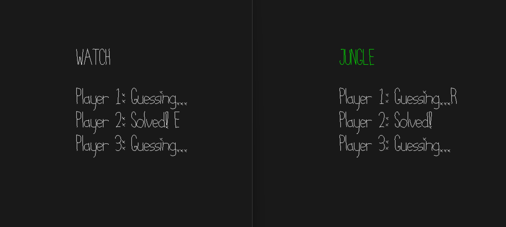

# Password Guesser

Author: David Lyons

Design: A group of up to 8 people each needs to type their password, but some players have jumbled keys!
Can you work together so that everyone solves their puzzle?

Networking: My multiplayer code is fairly simple. There are a few types of messages, and each has their own enum value.
Each value of that enum gets its own function. Clients only send keys to the server, but the server can send various messages to the clients.
The clients have multiple functions to read each of the different headers, and the server has multiple functions to send each of the different headers.
At any point, a player is either ABSENT, GUESSING, or SOLVED. If a player closes a connection, the server will not only remove it,
but send a status message to all other players denoting the absense. Conversely, if a player is added, the server will tell them that, too.
If a player is added, the server will also send it one message for each other player.
In other words, the tradeoff I chose is more messages, but each one having a smaller size.
Rather than sending the entire game state, I send individual messages denoting single updates to make to the game.

Screen Shot:

How To Play:

Up to 8 players can join. If more attempt to join, their screen will be blank, and they will lose connection to the server instantly.
This game is inspired by the Doctor Who puzzle in "Pyramids of Mars" where there are two robots, one that always tells the truth, and one that always lies.
In my game, some players "tell the truth" (their keys get sent correctly), and others "lie" (the server jumbles the input). 
I've programmed it so that half the players should be jumbled. If you managed to get a horrible random seed, and everyone is jumbled, reboot the server.
When you type a key, all other players (not including yourself) see what the server says you typed. Your goal is to type the word at the top of your screen.
If you're one of the non-jumbled players, this will be easy, but if you are jumbled, you'll need your friends to help you figure out the correct keys.

Strategy:

Here's the intended strategy. The players without a jumble should be able to type their word right at the start. 
Then everyone can see who has the correct keys. So then, someone should type a key. The "correct" players should type what they see,
and that will tell the first player what the server thinks they typed. Do this 26 times, and you can figure out the mapping.
Once all jumbled players figure out the mapping, you can all solve your puzzle.
A harder version of this game would not tell you when other people have solved the puzzle so that you don't know who is correct. In that case,
you would rely on the random seed giving you about half truth tellers, and you'd go with the majority response.

This game was built with [NEST](NEST.md).

